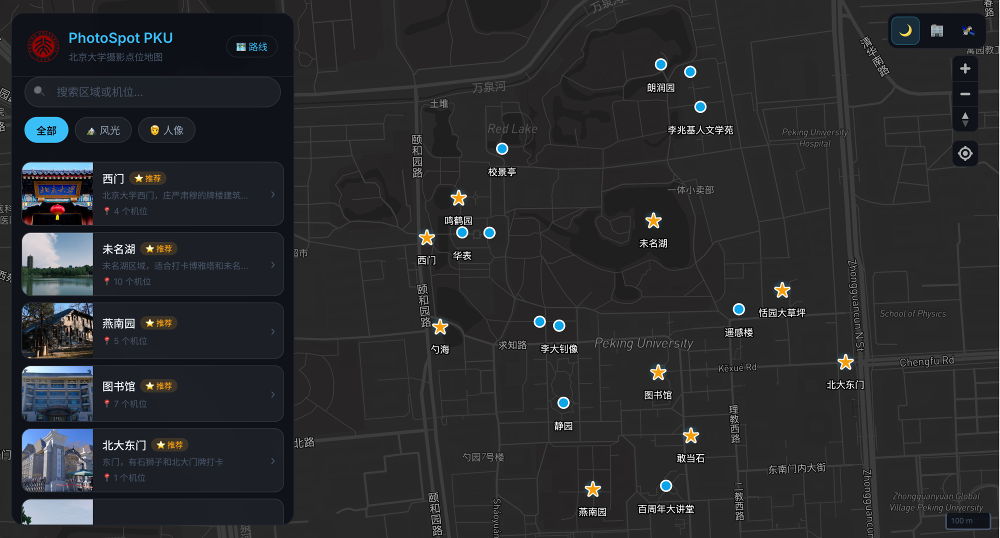

<p align="center">
  
</p>
<h1 align="center">PhotoSpot PKU📷</h1>

<p align="center">
  <strong>北京大学摄影点位地图</strong><br>
  探索燕园
</p>

<p align="center">
  <a href="https://raymond1030.github.io/PhotoSpot-PKU/">
    
  </a>
</p>
<p align="center">
  
  
  
  
</p>


PhotoSpot PKU 是一张为摄影爱好者打造的**北大校园交互地图**

我们以地图为媒，串联起燕园的每一处诗意光影，助你定格心中最美的北大。

从古朴庄严的西门，到波光潋滟的未名湖，再到巍然耸立的博雅塔——
每一个经典机位，我们都为你精确定位；每一张样片，都附上完整的拍摄参数，让你轻松复刻大片。

无论你是初来乍到、想探索未知北大的新生，还是追寻光影的摄影发烧友，       
希望PhotoSpot能成为你镜头下最美的向导。      

🎞️ 来这里，发现燕园的另一种方式。
用镜头，收藏北大的四季。            

<p align="center">
  
</p>

## 你可以用它做什么

- **浏览摄影区域** — 西门、未名湖、博雅塔……按区域探索校园中的拍摄热点
- **定位拍摄机位** — 每个区域下有具体的站位推荐，点击即可在地图上飞行定位
- **查看示例照片** — 浏览该机位的实拍样片，全屏查看细节
- **参考拍摄参数** — 每张照片叠加显示相机型号、焦距、光圈、快门速度等 EXIF 信息，方便你复刻同款
- **切换底图样式** — 暗色、街道、卫星三种地图风格，适应不同使用场景
- **手机也能用** — 响应式设计，手机端以底部抽屉形式浏览，支持手势拖拽

## 快速开始本地部署

```bash
# 克隆项目
git clone https://github.com/Raymond1030/PhotoSpot-PKU.git
cd PhotoSpot-PKU-Web

# 配置 Mapbox Token
cp .env.example .env
# 编辑 .env，填入你的 Mapbox Token
# 免费申请：https://account.mapbox.com/access-tokens/

# 安装依赖并启动
npm install
npm run dev
```

打开浏览器访问 `http://localhost:3000` 即可本地使用。

> **注意：** 不能直接双击打开 `index.html`，需要通过上述命令启动本地服务器。

## 关于数据

目前收录了 **19 个摄影区域**（一级点位）和 **42 个具体机位**（二级点位），覆盖燕园主要景观与建筑。

> **点位数据已开源！** `data/spot_data/` 目录下包含所有区域与机位的 GeoJSON 数据，欢迎使用和贡献。照片数据暂不开源。

## 参与贡献

欢迎通过 [Issues](https://github.com/Raymond1030/PhotoSpot-PKU/issues) 提出建议或反馈：

1. **贡献点位与照片** — 如果你有推荐的拍摄位置或照片，欢迎提 Issue 说明，照片也可以发送邮件到 raymondlo@stu.pku.edu.cn **（急需！！！）**
2. **功能建议** — 希望增加什么功能？告诉我们
3. **地图可视化意见** — 对地图样式、图层、交互有改进想法，欢迎反馈

## TODO

- 彩绘地图的底图
- 点位增加
- 风光照和人像的区分

## License

MIT
